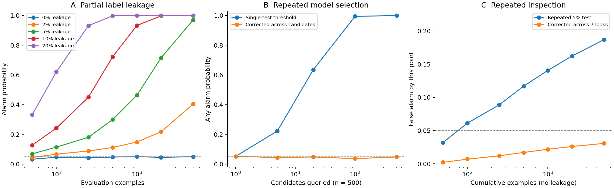

# Capped Evaluation under Leakage and Repeated Feedback

A small, reproducible **synthetic study** of leakage detection, model selection
and repeated testing, inspired by [CapBencher](https://arxiv.org/abs/2505.18102).

The experiments use a task with a known 50% expected matching cap. They contain
no real LLM inference or training. This repository is a preparatory reading and
implementation exercise, not a new detection method or a full reproduction of
the CapBencher paper. Implementation and execution were assisted by AI; all
parameters, source code and numerical results are available for inspection.



## Quick start

Python 3.11+; CPU only. No model weights, API key, GPU or proprietary data.

```bash
git clone --depth 1 https://github.com/shude-chen/shude-chen.github.io.git
cd shude-chen.github.io/research/capped-evaluation-pilot
python -m venv .venv
source .venv/bin/activate
python -m pip install -r requirements.txt
python run_experiment.py --out results --repeats 20000 --seed 20261002 > console_summary.json
```

On Windows, activate with `.venv\Scripts\activate` instead. The experiment is
kept in a separate research directory of the repository. If using the archive,
extract it and start with the virtual-environment command.

## Main observations

Each simulated condition uses 20,000 independent trials, seed 20261002.

| Setting | Measured result |
|---|---:|
| No leakage, 500 examples, single test | 4.74% false alarms |
| 10% probabilistic label leakage, 500 examples | 72.26% detection |
| 10% probabilistic label leakage, 2,000 examples | 99.75% detection |
| Fixed clean predictor, seven nominal 5% tests | 18.71% cumulative false alarms |
| Same seven looks, Bonferroni correction | 3.06% cumulative false alarms |
| Select among 100 fixed random candidates | 55.60% reused-set score; 49.99% fresh score |

The last row is test-set **selection overfitting**. It does not establish direct
training-data leakage or intentional cheating. Family correction for fixed
candidates is not a guarantee for arbitrary adaptively trained models.

## Construction

For an arithmetic sum such as 12+8, either 19 or 21 is a rule-compliant answer
under a minus/plus-one instruction. The evaluator independently chooses one
using a private fair coin. A predictor without access to that random choice
has expected match rate 50%. Finite samples may exceed 50% by chance, so alarms
use a one-sided exact binomial test rather than a raw score comparison.

Experiments cover independent probabilistic label exposure; feedback selection
from precommitted random predictors; nested inspection of one fixed predictor;
and one explicit exact-score reconstruction demonstration. Score-level sampling
is analytically equivalent to row-level random matching in the first settings.
It is not a model of language understanding or training dynamics.

## Contents

- [`run_experiment.py`](run_experiment.py): experiment and plotting code.
- [`report.md`](report.md): English methods, results and interpretation.
- [`METHODS.md`](METHODS.md): assumptions and statistical details.
- [`docs/guide_zh.md`](docs/guide_zh.md): Chinese explanation.
- [`results/`](results/): CSVs with trial counts and Wilson intervals, JSON
  environment metadata, explicit toy cases, and PNG/SVG figures.

The private target bits in `toy_task_examples.json` are exposed for offline
auditing of synthetic tasks. The feedback attack only receives evaluator scores.
No actual secret or third-party information is included.

## Verification

The code checks minimal exact-binomial cutoffs and exact label reconstruction.
The reported Monte Carlo rates were checked against analytic probabilities;
the largest difference was 3.23 Monte Carlo standard errors. A second full
run with the same seed reproduced all numerical JSON and CSV results byte for
byte. Environment versions and the experiment source SHA-256 are recorded in
`results/summary.json`.

## Scope

The main purpose is to understand finite-sample uncertainty, selection bias and
repeated inspection. The statistical corrections are elementary baselines.
The study does not validate enterprise knowledge-write-back reliability, and
does not claim an unexplored research gap: CapBencher already studies
leaderboard hacking with real models. Refer to the report for assumptions and
the distinction between a selected-test alarm and a fixed-predictor false alarm.

## Reference

Takashi Ishida, Thanawat Lodkaew, Ikko Yamane. **CapBencher: Give Your LLM
Benchmark a Built-in Alarm for Test-Set Overfitting.** ICML 2026.
[arXiv:2505.18102v7](https://arxiv.org/html/2505.18102v7).

This repository contains new implementation code for a simplified exercise;
the randomized-answer construction and binomial test are attributed to the
paper. No paper text, datasets or third-party code are redistributed.
